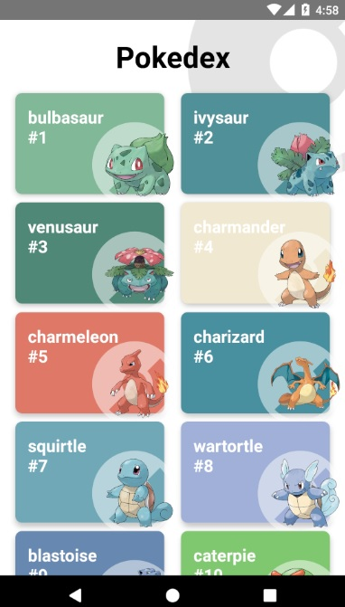
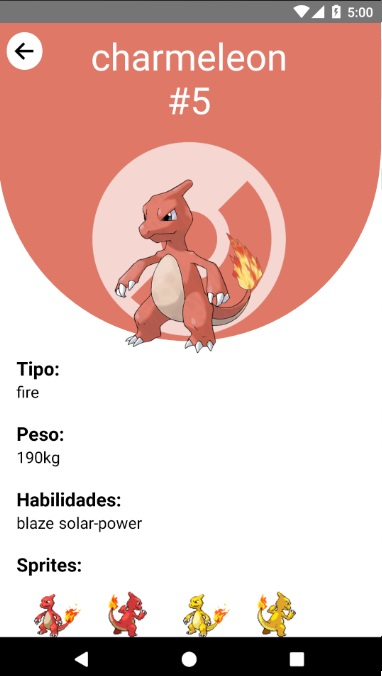

# Pokedex

App nativa multiplataforma desarrollada con React native consumiendo contenido de una API de pokemon pokeapi.co

## ¿Cómo funciona?

Requiere Node.JS 14

- `npm install` para instalar dependencias
- `npm start` para el entorno de desarrollo
- `npm run android` para iniciar app en android
- `npm run ios` para iniciar app en ios

## Lincencia

MIT
